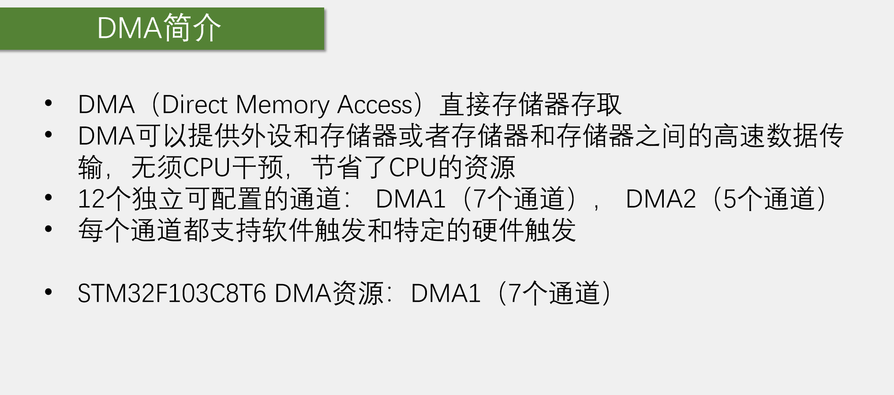
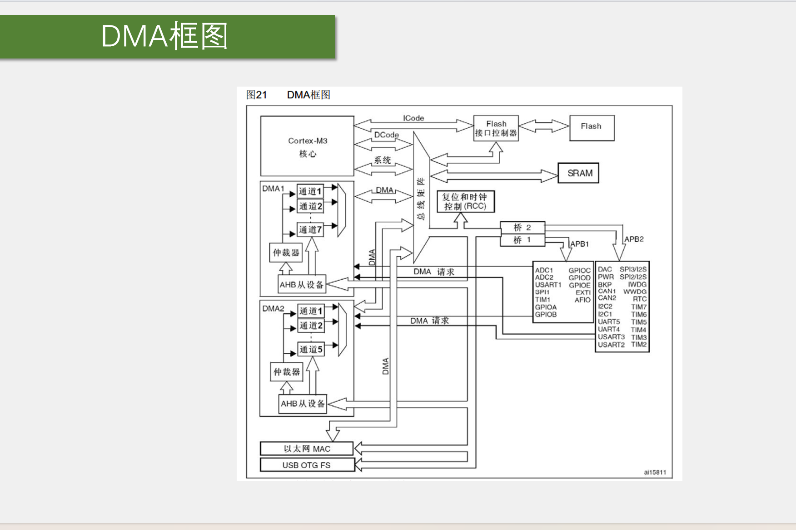
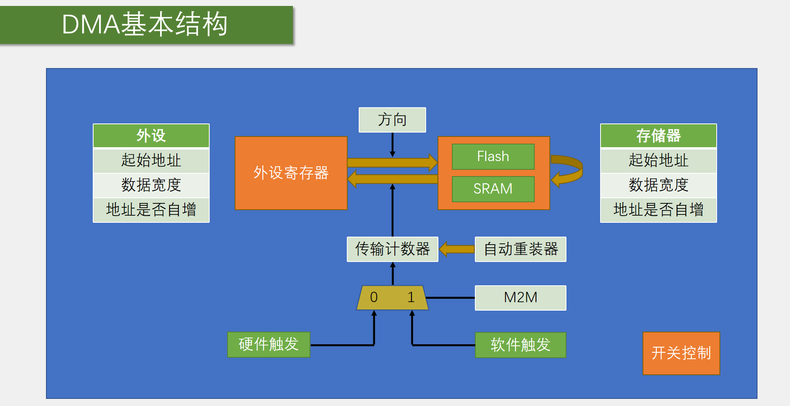

## DMA存储







DMA通常作为搬运工具，在CPU和硬件之间进行搬运工作

### 内部元件

- #### 站点1：外设寄存器

> ​	外设寄存器通常是外设的寄存器，存储着外设的数据，当然这个外设寄存器同样可以是其他存储器，只要把存储地址改成存储器地址就好	

1. 起始地址

   需要配置起始地址告诉DMA从哪里取数据

2. 数据宽度

   传输数据时的宽度，两个站点应该保持一致，这样输入和输出是一致的

3. 地址是否自增

   外设寄存器一般设置不自增，因为外设的地址通常是固定的，自增的目的是使存储地址连续。如果外设寄存器设置自增，可能会到替他外设之中

- #### 站点2：存储器

  1. 起始地址

     需要配置起始地址告诉DMA将数据放到哪里

  2. 数据宽度

     传输数据时的宽度，两个站点应该保持一致，这样输入和输出是一致的

  3. 地址是否自增

     存储器一般设置自增，这样就可以按顺序一个一个自动存储得到连续的地址

- #### 传输计数器

  **传输计数器里设置的是设定的要传输的数据的数量**

  - 循环模式
    - 开启循环模式之后，传输计数器减到零之后，自动回到初始值，实现无限循环
  - 单一模式
    - 每转运成功一次，传输计数器中数值减一，直到减到零，申请中断

- #### M2M

  - 硬件触发
    - 当M2M置0时，代表使用硬件触发，硬件触发的好处是和循环模式搭配可以实现硬件自动化，不需要再手动配置 适用于大量连续的数据传输
  - 软件触发
    - 当M2M置1时，代表使用软件触发，软件触发不能和循环模式同时使用，软件触发适用于 需要拷贝并不连续的数据

- #### DMA使能

  - 开启DMA

### 初始化配置

```c
void Init_MyDMA(uint16_t size,uint32_t AddrA,uint32_t AddrB)
    //传了三个参数，分别是外设寄存器的地址，存储器的地址，传输数量（传输计数器的值）
{
	MyDMA_Size=size;
	RCC_AHBPeriphClockCmd(RCC_AHBPeriph_DMA1,ENABLE);
    //开启时钟，注意这里是AHB总线
	DMA_InitTypeDef DMA_InitStructure;
    //初始化
	DMA_InitStructure.DMA_BufferSize=size;
    //这里传入参数size，只需要在主函数里给size赋值就可以改变传输的数据个数
	DMA_InitStructure.DMA_DIR=DMA_DIR_PeripheralSRC;
    //DIR是传输方向，这里将外设作为resource即起始站点
	DMA_InitStructure.DMA_M2M=DMA_M2M_Enable;
    //实例用了软件传输
	DMA_InitStructure.DMA_MemoryBaseAddr=AddrB;
    //存储器地址，传入参数，在主函数修改参数值就可以控制数据写入的地址
	DMA_InitStructure.DMA_MemoryDataSize=DMA_MemoryDataSize_Byte;
    //输出端单次传输的步长，可以选择按位传输、半字传输、整字传输
    DMA_InitStructure.DMA_MemoryInc=DMA_MemoryInc_Enable;
    //存储器地址自增
	DMA_InitStructure.DMA_PeripheralInc=DMA_PeripheralInc_Enable;
    //这里我们是想用两个数组传输，所以用了自增
	DMA_InitStructure.DMA_Priority=DMA_Priority_Medium;
    //传输优先级
	DMA_InitStructure.DMA_Mode=DMA_Mode_Normal;
    //传输模式，这里是软件触发，所以用的单一模式
	DMA_InitStructure.DMA_PeripheralBaseAddr=AddrA;
    //外部寄存器的地址，同理可以在主函数传入参数改变地址
	DMA_InitStructure.DMA_PeripheralDataSize= DMA_PeripheralDataSize_Byte;
    //输入端单次输入地址
	DMA_Init(DMA1_Channel1,&DMA_InitStructure);
	
	DMA_Cmd(DMA1_Channel1,DISABLE);
    //DMA使能

}
```

